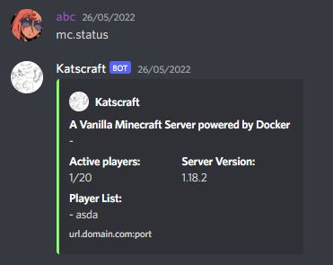
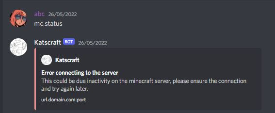

# Mosscraft

## Description

Discord bot that shows the status of your minecraft server making usage of the Query requests.

## Requirements

```bash
docker
docker-compose
git
```

## How to run

### Creating a docker network

First we need to create a docker network for our both containers (minecraft and discord) to communicate. 

```bash
docker network create my_minecraft_network
```

### Join already running container to the network created 

### Docker

```bash
docker network connect my_minecraft_network minecraft_server
```

### Docker-Compose

Where "..." stands for previous existing configuration.

```yaml
networks:
   ...
   my_minecraft_network:
      external: True
...

   minecraft_server:
       ...
       networks:
          ...
          my_minecraft_network:
```

### ready-to-go deploy with docker-compose

First we're going to build the docker images.

```bash
docker-compose build
```

Afterwards we can start the server.

```bash
docker-compose up -d
```

Finally we proceed to check the logs to see everything is working properly.

```bash
docker-compose logs -f
```


## Configuration

### Environments

| Environment                 | Default Value                                   | Description                                                                                                                                                                                         |
|-----------------------------|-------------------------------------------------|-----------------------------------------------------------------------------------------------------------------------------------------------------------------------------------------------------|
| MINECRAFT_HOSTNAME          | \<Null\>                                        | Hostname/IP to connect to the minecraft server/container.                                                                                                                                           |
| MINECRAFT_QUERY_PORT        | 25565                                           | Port to connect to the minecraft server through the RCON protocol (must be enabled on the server).                                                                                                  |
| MINECRAFT_RCON_PORT         | 25575                                           | *Not being used* Port to connect to the minecraft server through the RCON protocol (must be enabled on the server).                                                                                 |
| MEMCACHED_HOSTNAME          | \<Null\>                                        | Hostname/IP to connect to the memcached server/container.                                                                                                                                           |
| MEMCACHED_PORT              | 11211                                           | Port to connect to the memcached server.                                                                                                                                                            |
| MEMCACHED_USERNAME          | \<Null\>                                        | Username to authenticate to the minecraft server.                                                                                                                                                   |
| MEMCACHED_PASSWORD          | \<Null\>                                        | Password to authenticate to the minecraft server.                                                                                                                                                   |
| DISCORD_TOKEN               | \<Null\>                                        | Discord bot token.                                                                                                                                                                                  |
| DISCORD_PREFIX              | mc.                                             | Prefix for the discord bot to read the commands.                                                                                                                                                    |
| DISCORD_DESCRIPTION         | Hi, I'm a Bot! <br> My function is to help you! | Description for the bot.                                                                                                                                                                            |
| DISCORD_MC_URL              | \<Null\>                                        | Url to display for the users to join the server.                                                                                                                                                    |
| DISCORD_MC_REFRESH_COOLDOWN | 20                                              | (not implemented yet)(seconds) Cooldown before doing another request to the minecraft server and insert it to the memcached server (while on cooldown will grab the data from the memcached server) |

## Working Examples

### Status command example



### Connectivity error example


